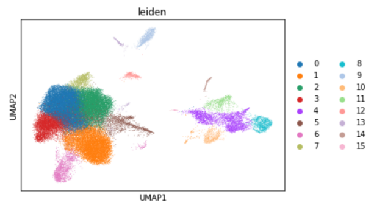

# Single-Cell RNA-Seq Analysis of Cerebrospinal Fluid

In this project, I used Python to recreate the single-cell clustering visualization in Figure 1B of [Neurological Manifestations of COVID-19 Feature T Cell Exhaustion and Dedifferentiated Monocytes in Cerebrospinal Fluid](https://doi.org/10.1016/j.immuni.2020.12.011) by Heming et al., published in Immunity. I analyzed publicly available cerebrospinal fluid data from patients with Neuro-COVID and other neurological conditions, using clustering, UMAP visualization and marker-gene analysis to explore immune-cell populations.

## Technologies

Python, Scanpy and AnnData.

## Methods

- Filtered cells based on gene counts, total counts and mitochondrial gene expression.
- Normalized and log-transformed the data, selected highly variable genes and regressed out technical effects.
- Scaled gene expression and used PCA to construct a neighborhood graph.
- Applied Louvain and Leiden clustering and generated PAGA-initialized UMAP visualizations.
- Used Wilcoxon and t-tests to rank differentially expressed genes and identify cell-type markers.

## Results

I generated UMAP visualizations with 16 clusters using both clustering methods and identified a CD8 T-cell-associated cluster through CD8A expression. Comparing the two approaches illustrated how clustering methods partition the same dataset and how marker genes connect computational clusters to biological cell identities.

Each point represents a cell, colored by its Leiden cluster. The two-dimensional layout summarizes similarities in gene expression.

## Full Report

The [full project report](Single%20Cell%20RNA-Seq%20Clustering%20of%20CSF%20Cells%20in%20N-Covid%20Patients.pdf) includes the biological background, detailed methods, figures, comparison with the original publication and discussion of the results.
